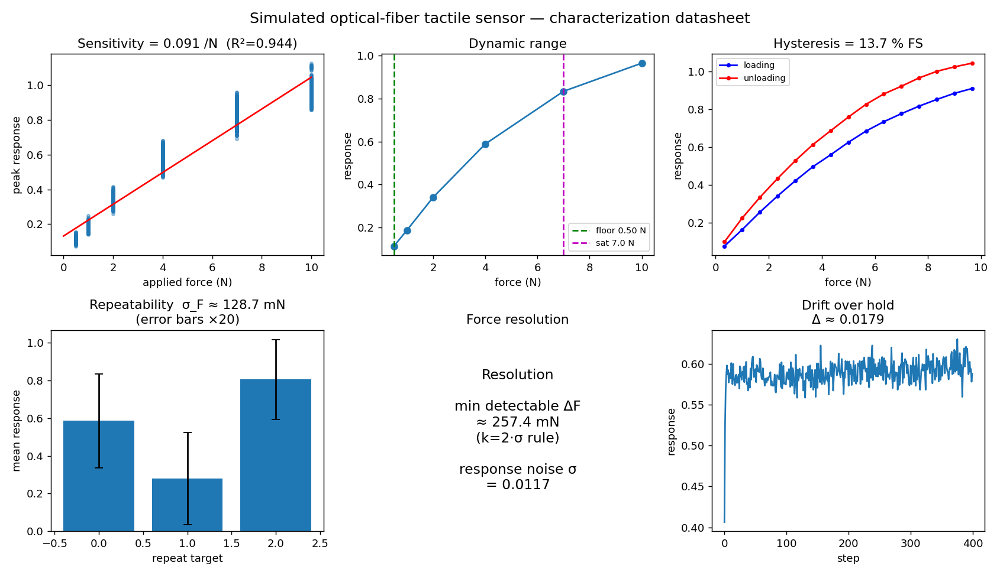
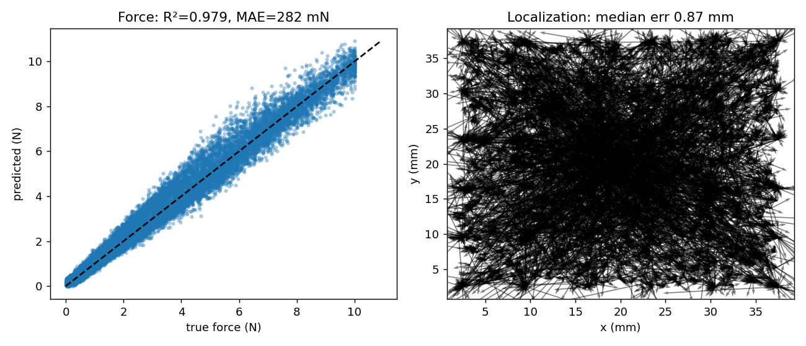
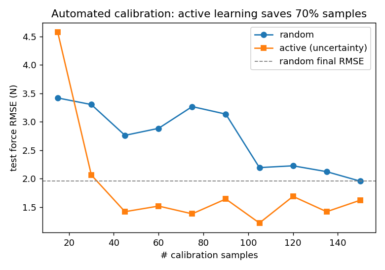

# Fiber-Tactile-Calibration-Sim

**A simulated, high-throughput robotic calibration & characterization platform for a custom optical-fiber tactile sensor.**

This project reproduces — entirely in software — the kind of automated test rig used to characterize a contact sensor and generate force↔response data pairs for model training. A virtual indenter presses a sensorized patch under closed-loop force control; an optical-fiber **forward sensor model** turns each contact into noisy multi-channel readings; an **inverse model** learns to recover contact force and location; and a characterization stage measures the sensor's resolution, sensitivity, range, hysteresis and repeatability.

> Built as a portfolio piece for the ETH RSL project *"Robotic setup for contact sensor characterization."* No hardware was used — the rig, sensor, and calibration loop are simulated — but the architecture is **hardware-ready**: a real Arduino + FSR rig drops into the same interface (see [`firmware/`](firmware/)).

---

## Demo

```bash
pip install -r requirements.txt
python scripts/run_experiment.py      # generate the dataset (~112k rows, ~20 s)
python scripts/run_analysis.py        # train inverse models + characterize -> figures/
python scripts/run_active_learning.py # automated-calibration sample-efficiency study
streamlit run app/dashboard.py        # interactive demo
```

| Characterization datasheet | Inverse-model results |
|---|---|
|  |  |

---

## Results (seed 42, config sha `acb8130d`)

**Inverse calibration model** (press-grouped split — no trajectory leakage):

| split | model | detection F1 | force R² | force MAE | localization (median) |
|---|---|---|---|---|---|
| random | linear | 0.97 | 0.969 | 354 mN | 6.57 mm |
| random | **MLP** | 0.97 | **0.987** | **223 mN** | **0.81 mm** |
| spatial-holdout | linear | 0.96 | 0.682 | 915 mN | 17.6 mm |
| spatial-holdout | MLP | 0.96 | **−2.97** | 2559 mN | 10.2 mm |

The **spatial-holdout collapse** is a deliberate, honest result: when an entire surface quadrant is never probed, the flexible MLP extrapolates catastrophically while the linear model degrades gracefully. This is *why* calibration must cover the whole sensor — and it motivates the active-learning study below.

**Sensor characterization** (auto-generated datasheet):

| metric | value |
|---|---|
| sensitivity | 0.096 /N (linearity R² = 0.95) |
| force resolution (2σ) | 247 mN |
| detection floor / saturation | 0.5 N / 7.0 N |
| hysteresis | 14.0 % FS |
| repeatability (σ_F) | 124 mN |

**Automated calibration** (active vs random sampling): core-set selection picks which probes to execute using only the *commanded* (x, y, force) coordinates — no up-front probing — and only the chosen probes are pressed, so the x-axis is genuine hardware presses. On a realistic *biased* probe pool (clustered locations, force skewed to the saturated regime) it reaches random's final force-RMSE with **70 % fewer samples**; on a uniform pool there is no gain — reported honestly. 

---

## How it works

```
 IndenterControllerNode ──/cmd_force──▶  SimNode ──/contact_state──▶ SensorNode
   (Hertzian force-control                (analytic contact         (optical-fiber
    state machine)                         ground truth)             forward model)
                                                                          │
                                                                /sensor_readings
                                                                          ▼
        EstimatorNode  ◀──/dataset──  LoggerNode (Parquet)  ◀────────────┘
   (inverse ML + characterization)
```

The data flow is wired through a small **ROS2-style node/topic layer** (`rosmimic.py`) — the architecture is ROS-shaped without the install friction, and any node is a drop-in `rclpy` port.

### The forward sensor model (`sensor_model.py`) — the scientific core
A single contact `(x, y, force)` becomes 64 channel readings via, in order:
spatial Gaussian **load-spreading** (width set by the **Hertzian contact patch**, so force *and* indenter radius matter) → **tanh saturation** → channel **crosstalk** → first-order **response lag** → slow **drift** → read **noise** → 12-bit **ADC** quantisation. The ML side never sees these parameters — it must learn the inverse from data alone, so the calibration task is genuine, not circular.

### Hardware Abstraction Layer (`hal.py`)
`SimRig` and `ArduinoRig` expose the same `press(x, y, force)` interface, and `ArduinoRig` implements the real serial read loop (firmware in [`firmware/`](firmware/)). The entire pipeline — logging, ML, characterization — runs unchanged on either rig and is **channel-count agnostic** (a 4-FSR real rig and the 64-channel sim both flow through `ml.py`/`metrics.py`), so going to hardware is a flag, not a rewrite:

```bash
python scripts/run_experiment.py --rig arduino --port /dev/ttyACM0
```

---

## Repository layout

```
config/experiment.yaml     reproducible config (hashed into every dataset)
src/fibercal/
  schema.py                the dataset contract (single source of truth)
  rosmimic.py              ROS2-style node/topic layer
  contact.py               Hertzian contact + force-control state machine
  sensor_model.py          optical-fiber forward model  ← scientific core
  hal.py                   sim/real Hardware Abstraction Layer
  sweeps.py                grid/random/ramp/repeat data collection
  ml.py                    inverse models + leakage-safe splits
  metrics.py               sensor characterization
  active_learning.py       core-set automated calibration
  viz.py                   figures
scripts/                   run_experiment / run_analysis / run_active_learning
app/dashboard.py           interactive Streamlit demo
firmware/                  Arduino + FSR sketch (the real-rig HAL path)
tests/                     fast pipeline tests
docs/                      roadmap, literature review, work-package mapping
```

See [`docs/workpackage_mapping.md`](docs/workpackage_mapping.md) for how each component maps to the target project's work packages, and [`docs/roadmap.md`](docs/roadmap.md) for what a real-hardware continuation looks like.
